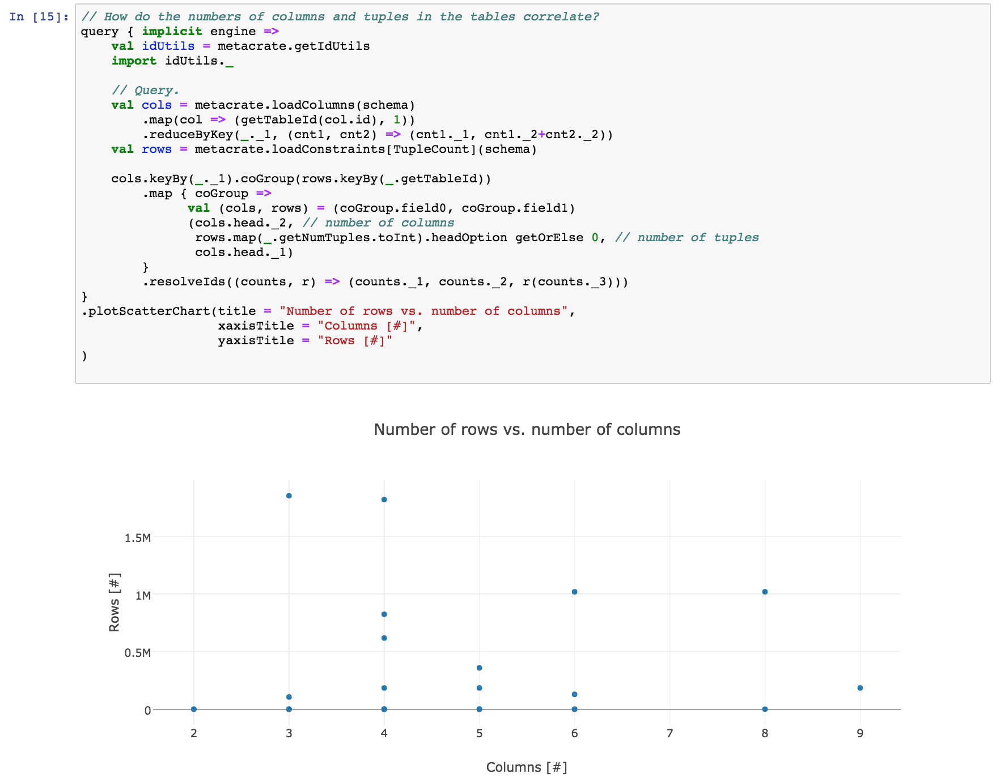

# Metacrate Demo (CIKM 2017)

This repository contains Jupyter notebooks for the demonstration of Metacrate at CIKM'17. Specifically, we provide the following notebooks:

* The `data-anamnesis` notebook exemplifies how to make initial contact with a dataset and understand basics, such as how much data is provided, what are the important tables, and what it technical schema constraints it has.
* The `data-cleaning` notebook shows how data profiling results help to detect data quality issues. We address the problem of missing data, overly generic join relationships, and de-normalization.
* The `data-discovery` notebook outlines how a data scientist can employ data profiles to detect relevant data within a dataset. We show how to cluster columns by their content and how to detect fuzzy join relationships.

For further information on Metacrate and high-level artifacts, also visit our [web page](https://hpi.de/naumann/projects/data-profiling-and-analytics/metacrate.html).

## Installation

To run the notebooks, you will need [Jupyter](https://jupyter.org/), the [Jupyter-Scala kernel](https://jupyter-scala.org/), and Metacrate.
Then
1. follow the installation instructions from the [Metacrate repository](https://github.com/stratosphere/metadata-ms),
2. start Jupyter from within the directory you cloned this repository to,
3. open one the above described notebooks,
4. select the Jupyter Scala kernel, and
5. execute the notebook.

If everything went right, you should see outputs as in the screenshots below. If not, feel free to contact us or file an issue.

## Examples

**Example 1.** Analyze the table sizes in a dataset by combining their numbers of columns and tuples and displaying the result in a scatter chart.

**Example 2.** Show the information content of tables as well as the information content of join relationships to other tables. Display the result in a chord plot.

**Example 3.** Having assessed the importance of tables and having clustered the tables, plot the enriched schema graph.

